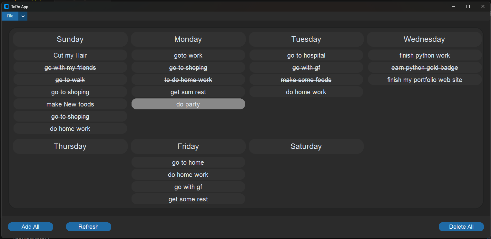
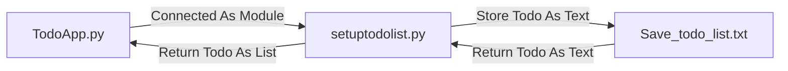

# Python Tkinter Todo App.

This is a personal project I created for fun using Python and the Tkinter library to build a simple and functional Todo App. The app utilizes a TXT file to store weekly tasks and provides an easy way to manage your to-dos. The project is open-source and available for anyone to clone, explore, and use.



## Project Details

### Folder Structure
```bash
├── Todo_App
│   ├── App Design Data and Diagrams
│	│   ├── Todo App (Python) Diagram.jam
│	│   ├── ToDo App (python).fig
│   ├── src
│	│   ├── functions
│	│	│   ├── printtables.py
│	│	│   ├── setuptodolist.py
│   ├── .gitignore
│   ├── 3 - (just old code)
│   ├── icon.ico
│   ├── TodoApp.py
│   ├── TodoApp.spec
│   ├── README.md
│   ├── requirements.txt
└── └── Save_todo_list.txt
```

## Project Start

### Install the packages.

You can install the packages easily by using this command.

 - customtkinter==5.2.2
 - prettytable==3.12.0
 - pyinstaller==6.11.1

```bash
pip install -r requirements.txt
```

### Run the App
To test the application, you can run it using the following commands:

 1. Navigate to the project directory where the script is located.
 2. Execute the script with Python.

```bash
py TodoApp.py
```
or
```bash
python TodoApp.py
```
or
```bash
python3 TodoApp.py
```

## Generate The .EXE file.

To generate an executable file, use the PyInstaller library. The code is designed to be compatible with PyInstaller, allowing you to generate a `.exe` file with a single command.

```bash
pyinstaller TodoApp.spec
```
or, to generate the `.exe` file with more control, you can use the following command:
```bash
pyinstaller --name TodoApp --onefile --windowed --icon=icon.ico TodoApp.py
```
You can customize the app's icon by replacing it with your desired icon file.
> **Note:** The icon file must be located in the root directory of the project for PyInstaller to detect it correctly.

## Run the .EXE file.

Before running the `.exe` file, ensure that the `src` directory is included in the same folder as the `.exe` file. This ensures the application has access to all required resources.

**File Structure.**
```bash
├── Todo_App
│   ├── src
│	│   ├── functions
│	│	│   ├── printtables.py
│	│	│   ├── setuptodolist.py
│   ├── TodoApp.exe
└── └── Save_todo_list.txt
```
>**Note:** The `Save_todo_list.txt` file will be automatically created when you start adding tasks to the app.


## Diagrams

**This is the program's flowchart::**
the app stores the todo list in a **`save_todo_list.txt`** file and retrieves it as a list for use within the application. The **`setuptodolist.py`** module is responsible for writing the todo list to the text file and converting the stored data back into a list format for seamless integration with the app.

